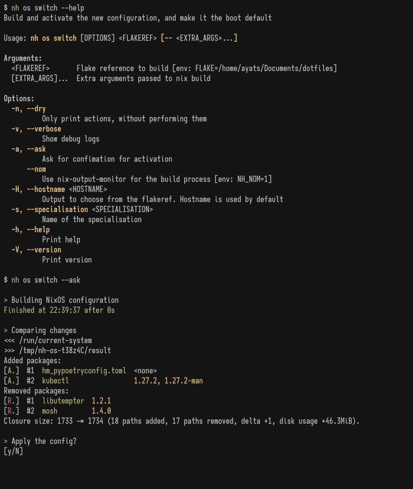

<h1 align="center">nh</h1>

<h6 align="center">Because the name "yet-another-nix-helper" was too long to type...</h1>

<p align="center">
  
  </a>
</p>



## What does it do?

NH reimplements some basic NixOS commands. It supports building and properly activating a NixOS config that uses [specialisations](https://search.nixos.org/options?channel=unstable&show=specialisation).

It also includes `nvd` to show a pretty diff of the transaction, adds confirmations prompts and lets you pre-configure the path to your NixOS config.

List of subcommands:

- [x] Reimplement `nixos-rebuild {switch,boot,test}`
- [x] Reimplement `home-manager switch`
- [x] Reimplement `nix-collect-garbage`
  - [ ] handle gcroots
- [ ] Reimplement `nix search`
- [ ] NixOS / HM system info

## Installation

### I just want the CLI

`nh` is in this flake's `packages.<system>.default` output, so throw it into your config however you want. Feel free to override this flake's nixpkgs by using `nh.inputs.nixpkgs.follows`.

### Configure FLAKE env variable

`nh` uses the `FLAKE` env variable as a default for `os {switch,boot,test}`, so you don't have to pass the path to your flake with every command, just call the command without arguments.

For NixOS, configuring it could be as simple as:

```nix
{...}: {
    environment.sessionVariables.FLAKE = "/home/ayats/Documents/dotfiles";
}
```

### Configure specialisations

NH is capable of detecting which spec you are running, so it runs the proper activation script.
To do so, you need to give NH some information of the spec that is currently running by writing its name to `/etc/specialisation`. The config would look like this:

```nix
{...}: {
    specialisation."foo".configuration = {
        environment.etc."specialisation".text = "foo";
    };

    specialisation."bar".configuration = {
        environment.etc."specialisation".text = "bar";
    };
}
```

<details>
<summary>Why are specialisations broken with nixos-rebuild?</summary>

To understand why `nixos-rebuild` doesn't work[^1], we must know that it is just a shell wrapper around a more fundamental script from NixOS: `<toplevel package>/bin/switch-to-configuration`[^2].

This scripts has 2 possible commands: `boot` and `test`. What `nixos-rebuild` and `nh` do is basically building the toplevel pkg, and running `switch-to-configuration`. For `switch`, we run `test+boot` one after the other.

So, with specialisation, this changes. Specs create "another toplevel" under `<toplevel>/specialisation/<spec toplevel>`, with its own `/bin/switch-to-configuration`. Which one should we run?

- For `test`: `<toplevel>/specialisation/<spec>/bin/switch-to-configuration test`
- For `boot`: `<toplevel>/bin/switch-to-configuration boot`

We must run the namespaced one for `test`, and the root one for `boot`. Which is what `nixos-rebuild` doesn't do properly.


</details>

## Hacking

`nix develop`

[^1]: At the time of this writing.

[^2]: The toplevel package is what you can build with `nix build /flake#nixosConfiguration.HOSTNAME.config.system.build.toplevel`, and what sits on `/run/current-system`, `/run/booted-system` and `/nix/var/nix/profiles/system`.
